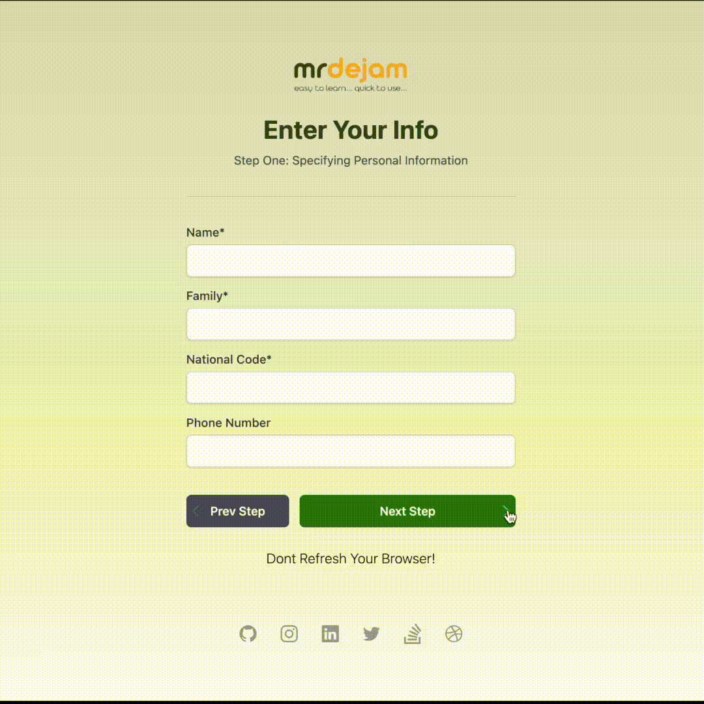

  <a href="https://dejam.ir">
    <picture>
      <source media="(prefers-color-scheme: dark)" srcset="./public/multistep.gif">
      
    </picture>
    <h1 align="center">MultiStep-With-Validation</h1>
  </a>

  
  
  

## Getting Started

1- npm install

2- npm run dev

## Authors

- mohamadreza dejam ([@mrdejam](https://instagram.com/mrdejam))

## Security

If you believe you have found a security vulnerability in Next.js, we encourage you to responsibly disclose this and not open a public issue. We will investigate all legitimate reports. Email `dejamdev@gmail.com` to disclose any security vulnerabilities.

https://dejam.ir/
